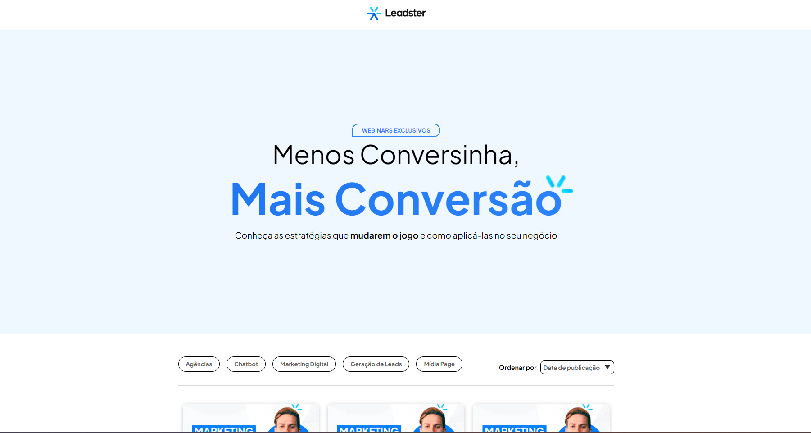

# Teste Leadster Front End

## Decisões

O projeto era criar uma Landing usando Next Js e Styled components. Foi nos dado um Layout padrão em PNG sem qualquer medida auxiliar e pra isso tivemos que pensar nossos proprios padrões de medidas designs o que foi bem interessante e mais desafiador do que apenas ter o projeto pronto no Figma. Utilizei Typescript e resolvi trabalhar me inspirando no design que foi me dado e também pegando alguns aspectos existentes da propria Leadster.

## Como Organizei ?

A principio tive que tratar os erros de compatibilidade do Styled Components com Next Js crinado meu arquivo registry.tsx que garante o tratamento certo do styled components no Server Side rendering e também no lado do cliente.
Para uma melhor organização e otimização do meu código resolvi trabalhar com a pasta App do Next js 13. Nesta pasta posso criar um arquivo page.tsx aonde seria a pagina principal da minha aplicação, criei algumas páginas dentro dela também que são as pastas ( agencia, chatbot, login, marketing e midia ) essas pastas guardam as rotas que eu utilizei na aplicação.Fiz o uso do react context para guardar estado globais dos meus botões que definem essas rotas. Também fiz uma páginação para cada rota além disso criei arquivos constants novos para cada página aberta por estes botões pasando como props esses Arrays no meu componente <VideoRow />.
Utilizei Typescript para fazer o código tipado e criei um arquivo de Types que descreve o tipo do objeto que seria os "Videos" listados, na outra pasta contants eu pude guardar esses objetos que estão sendo imprimidos dinâmicamente nos meus components de CardModel,VideoRow e também em minhas páginas , caso mude algo nas constants mudará automaticamente nos componentes também.
Styled Components: Por que optei por não separar meus arquivos de estilos do meu código JSX ? A ideia do styled components para mim é ter essa facilidade de poder ter estilos e jsx tudo em uma página apenas, contudo, para projetos maiores de grande complexidade vejo mais vantagens em trabalhar com arquivos de estilos separados. Mas eu opto em projetos menores preferencialmente por causa de (Facilidade de leitura, manutenção, Escopo local e Reutilização limitada).

## Como Rodar ? 

Para rodar o projeto basta copiar estes arquivos para seu computador logo em seguida instalar as depências com `yarn install` e depois `yarn dev` para rodar o projeto.
Requisitos:
- Node: v18.16.0
- Yarn: 1.22.17

